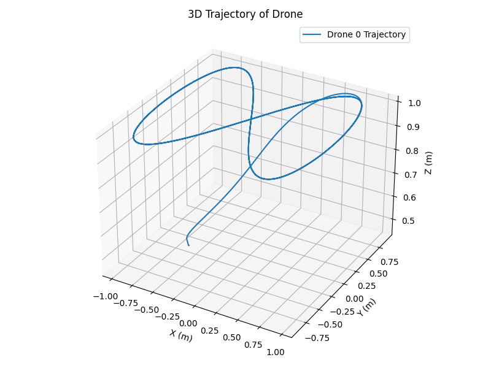
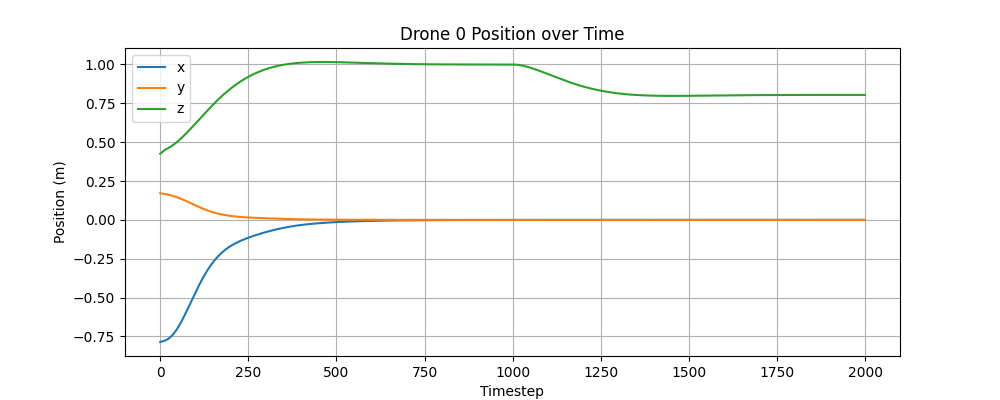
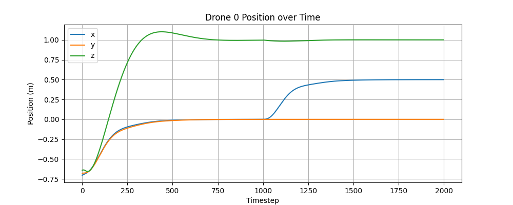

# Aerial Gym Experiments

## About Aerial Gym Simulator

The Aerial Gym Simulator is a high-fidelity, physics-based simulation platform designed for training Micro Aerial Vehicles (MAVs), such as quadrotors and multirotors, in complex and cluttered environments. It is built on top of NVIDIA Isaac Gym, leveraging GPU acceleration to support large-scale, parallel simulations of thousands of drones in real time. This simulator supports a variety of MAV configurations, including: Standard planar quadrotors, fully-actuated multirotors, and custom platforms with arbitrary rotor geometries

Each configuration is equipped with both low-level and high-level geometric controllers implemented directly on the GPU for efficient control execution.

The simulator is especially useful for learning-based control and planning methods that require extensive interaction with a physics environment. It is actively maintained and used by the Autonomous Robotics Lab at NTNU. For official documentation and reference, please visit the [NTNU Aerial Gym Github repository](https://github.com/ntnu-arl/aerial_gym_simulator)

## Installation

The Aerial Gym Simulator is built on NVIDIA Isaac Gym and supports Linux systems with Python 3.6+ and CUDA-enabled GPUs. Please follow the official installation guide for the base simulator:

**Official Setup Instructions:** [https://ntnu-arl.github.io/aerial_gym_simulator/2_getting_started/](https://ntnu-arl.github.io/aerial_gym_simulator/2_getting_started/)

NOTE: This requires installing Isaac Gym Preview 4 Release [https://developer.nvidia.com/isaac-gym/download](https://developer.nvidia.com/isaac-gym/download)

## Folder Structure and Project Overview

Understanding the folder structure of the Aerial Gym Simulator is critical for successfully setting up experiments, modifying controllers, and debugging simulation behaviors. Below is a simplified breakdown of the directory tree along with descriptions to help new users navigate the codebase effectively.

### Expected Base Directory Layout
```
aerial_gym_simulator/
├── aerial_gym/                 # Core simulator code including envs, control, robot config
├── aerial_gym.egg-info/        # Package metadata (autogenerated)
├── docs/                       # Documentation folder (can be extended)
├── resources/                  # Robot URDFs, environment assets, etc.
├── supplementary_material/     # Additional materials (figures, extra configs)
├── LICENSE                     # License file
├── mkdocs.yml                  # Configuration for MkDocs (if using for docs)
├── pyproject.toml              # Python packaging metadata
├── README.md                   # Main project description and usage
├── requirements.txt            # Python dependencies
└── setup.py                    # Setup script for pip installation
```

### Important Subfolders

- **aerial_gym/config/robot_config/** 
  Contains YAML or Python config files for each robot type. These specify:
  - URDF file path
  - Asset name and robot name
  - Mass, inertia, and collision properties

- **aerial_gym/control/** 
  Holds all geometric controllers. Look into `__init__.py` to understand which controller is used for which robot (e.g., `lee_position_control`, `lmf2_position_control`).

- **aerial_gym/envs/** 
  Environment definitions used in training or evaluation.

- **aerial_gym/examples/** 
  Sample scripts to test position control, multi-agent experiments, and benchmark scenarios. You’ll modify these to test new scenarios (e.g., payload drop, wind disturbance).

## Position Control in Aerial Gym

This section walks through a baseline position control example for a single quadrotor in Aerial Gym. It uses a pre-coded geometric controller to move the drone along a smooth figure-8 trajectory while recording position and orientation data.

### File: `position_control_example.py`

This script demonstrates how to:
- Load the simulator with a single quadrotor (`base_quadrotor`)
- Use a geometric controller (`lmf2_position_control`) to track a position setpoint
- Log position, orientation (quaternion), and Euler angles at each timestep
- Save the collected data to `.npz` files for later analysis or plotting

### What the Code Does

#### 1. Environment Setup
```python
env_manager = SimBuilder().build_env(
    sim_name="base_sim",
    env_name="empty_env",
    robot_name="base_quadrotor",
    controller_name="lmf2_position_control",
    device="cuda:0",
    num_envs=1,
    headless=args.headless,
    use_warp=args.use_warp,
)
```
This initializes a simple simulation environment with a single quadrotor and a geometric position controller. The simulation runs on the GPU (`cuda:0`).

#### Changing the Quadrotor Model
You can easily switch between different types of quadrotors by modifying the `robot_name` and `controller_name` fields inside the `build_env()` function:
```python
robot_name="lmf2",
controller_name="lee_position_control",
```
Make sure the `robot_name` corresponds to a valid robot model defined in:
```
aerial_gym_ws/src/aerial_gym_simulator/aerial_gym/config/robot_config/
```

All robot model URDFs are stored in:
```
aerial_gym_ws/src/aerial_gym_simulator/resources/robots
```
This is where the simulator loads the physical configuration (mass, inertia, motor placement, etc.) of each quadrotor. If you ever want to modify the robot’s structure or parameters, this is the place to look.

To find which controller corresponds to which robot model, you can refer to the registry defined in:
```
aerial_gym_ws/src/aerial_gym_simulator/aerial_gym/control/__init__.py
```
Ensure both the robot name and controller name are valid pairs, otherwise the simulation may crash or misbehave.

#### 2. Defining the Trajectory
```python
A, B = 1.0, 1.0
omega = 0.2
z_fixed = 1.0
```
This creates a figure-8 shaped trajectory in the XY plane with constant altitude z = 1.0. At each timestep, the target `[x, y, z, yaw]` is computed and passed as an action to the controller.

#### 3. Main Simulation Loop
```python
for i in range(10000):
    t = i * dt
    actions[:, 0] = A * math.sin(omega * t)
    actions[:, 1] = B * math.sin(2 * omega * t)
    actions[:, 2] = z_fixed
    actions[:, 3] = 0.0
    env_manager.step(actions=actions)
```
The drone receives new target setpoints at every step and the simulation advances one step using `env_manager.step()`.

#### 4. Data Logging
The following tensors are extracted using `get_obs()` at each step:
- `robot_position`
- `robot_orientation`
- `robot_euler_angles`

These are saved into NumPy `.npz` format:
```python
np.savez("collected_data/positions.npz", positions=all_positions)
np.savez("collected_data/orientations.npz", orientations=all_orientations)
np.savez("collected_data/euler_angles.npz", euler_angles=all_euler_angles)
```

#### Output Files
After simulation ends, the following files are created in the `collected_data/` folder:
- `positions.npz`: shape (T, 1, 3) — x, y, z over time
- `orientations.npz`: shape (T, 1, 4) — quaternion
- `euler_angles.npz`: shape (T, 1, 3) — roll, pitch, yaw (in radians)

These files can be loaded using NumPy and visualized using `matplotlib`.


#### Why This Script is Important
This is the baseline setup that all other experiments build upon. If you're trying to simulate effects like mid-flight payload attachment or wind disturbances, you’ll be updating this exact file.

Start here, run the example, make sure `.npz` files are saved, and visualize the results to get familiar with the workflow.


## Payload Attachment Mid-Flight (via Runtime Mass Update)
This section demonstrates how to simulate the attachment of a payload mid-flight by modifying the drone's mass during simulation.

### Motivation
In real-world scenarios, quadrotors often pick up or drop payloads during missions. We simulate this behavior by increasing the mass of the quadrotor mid-flight and observing how the controller reacts.

### Isaac Gym Limitation (CPU Pipeline Required)
Due to limitations in Isaac Gym Preview 4, runtime modification of rigid body properties (like mass or center of mass) is only supported using the CPU pipeline. The GPU pipeline does not reliably apply such updates. See:
1. Isaac Gym Forum: apply_body_force issue (https://forums.developer.nvidia.com/t/apply-body-force-generates-very-different-effects-depending-on-use-gpu-pipeline-is-true-or-false/165477)
2. Isaac Gym Forum: CoM limitations (https://forums.developer.nvidia.com/t/how-to-change-the-base-rigid-bodys-center-of-mass-after-the-actor-is-loaded/273946)

### Enforcing CPU Pipeline
```
python 
env_manager = SimBuilder().build_env(
    sim_name="base_sim",
    env_name="empty_env",
    robot_name="base_quadrotor",
    controller_name="lmf2_position_control",
    device="cpu",             # Use CPU pipeline
    num_envs=1,
    headless=args.headless,
    use_warp=False            # Disable GPU acceleration
)
```

### Applying the Payload Mid-Flight
At a predefined timestep (e.g., i == 1000), we fetch the rigid body properties of the quadrotor and increase it's mass:
```
python
body_props = IGE_env.gym.get_actor_rigid_body_properties(env_handle, actor_handle)

original_mass = body_props[0].mass
payload_mass = 0.005  # 5 grams

new_mass = original_mass + payload_mass
body_props[0].mass = new_mass
```

### Updating the Inertia
To maintain dynamic stability, the inertia tensor is scaled accordingly:
```
python
scale = new_mass / original_mass
inertia_tensor = body_props[0].inertia
inertia_tensor.x *= scale
inertia_tensor.y *= scale
inertia_tensor.z *= scale
body_props[0].inertia = inertia_tensor
```

### Applying the Updated Properties
Once the updated properties are prepared, apply them using:
```
python 
IGE_env.gym.set_actor_rigid_body_properties(
    env_handle,
    actor_handle,
    body_props,
    recomputeInertia=False
)

```

### Result

The drone's Z-position shows a small dip after the mass increase, followed by correction via the position controller — confirming the success of this simulation.

This approach offers a realistic and reproducible way to simulate payload attachment without switching URDFs or modifying the controller logic.

## Simulating Wind Disturbance Mid-Flight
This section explains how to simulate an external wind disturbance acting on a quadrotor during hover. We modify the baseline position control example and inject a lateral force (e.g., in +X direction) during flight to mimic the effect of wind. This test helps evaluate how well the drone maintains its position under external perturbations.

### Motivation
Instead of modifying aerodynamic models or manually injecting new physics constraints, we simulate wind by applying a constant external force to the drone’s body using the global force tensor.

This method is Simple and Effective.

### Key Implementation HIghlights:
Key Implementation Highlights

   1. Wind is simulated as a persistent force vector in a chosen direction.

   2. The disturbance starts after a specific timestep (wind_step) and remains active for the rest of the simulation.

   3. The controller remains active, allowing us to evaluate its response to the disturbance.

### Wind Disturbance Code Summary
#### Apply wind force after a chosen timestep:
```
python
wind_step = 1000
wind_force = torch.tensor([10.0, 0.0, 0.0], device="cuda:0")  # Wind along +X axis
```

#### Get base link index to apply force:
```
python
body_index = IGE_env.gym.find_actor_rigid_body_handle(env_handle, actor_handle, "base_link")
```

#### Inside the simulation loop:
```
python
for i in range(2000):
    if i == wind_step:
        logger.warning(f"Applying wind force at step {i}")

    if i >= wind_step:
        IGE_env.global_tensor_dict["global_force_tensor"][body_index] = wind_force
    else:
        IGE_env.global_tensor_dict["global_force_tensor"][body_index] = torch.tensor([0.0, 0.0, 0.0], device="cuda:0")

    env_manager.step(actions=actions)
```

#### Controller target (hover setpoint remains the same):
```
python 
actions[0, :] = [0.0, 0.0, 1.0, 0.0]  # hover at 1 meter
```

This method allows testing robustness of geometric controllers to external forces without changing URDFs or physics engines. It is also extensible: you can simulate time-varying wind (e.g., gusts) by making wind_force dynamic.
## Author
Pranav Kulkarni — UC San Diego ERL

